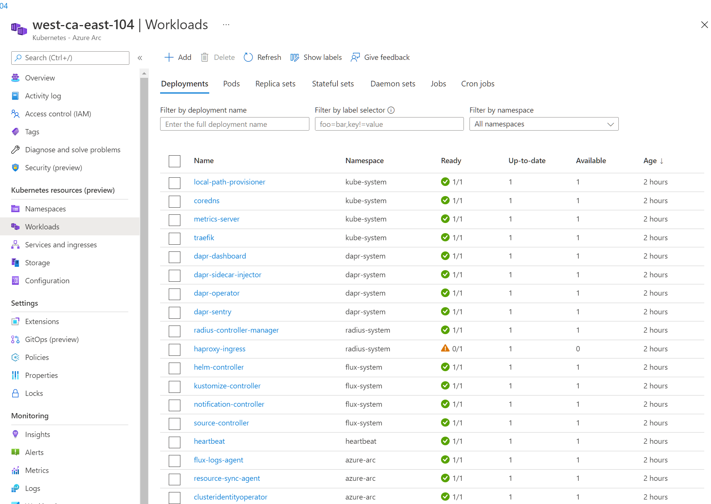
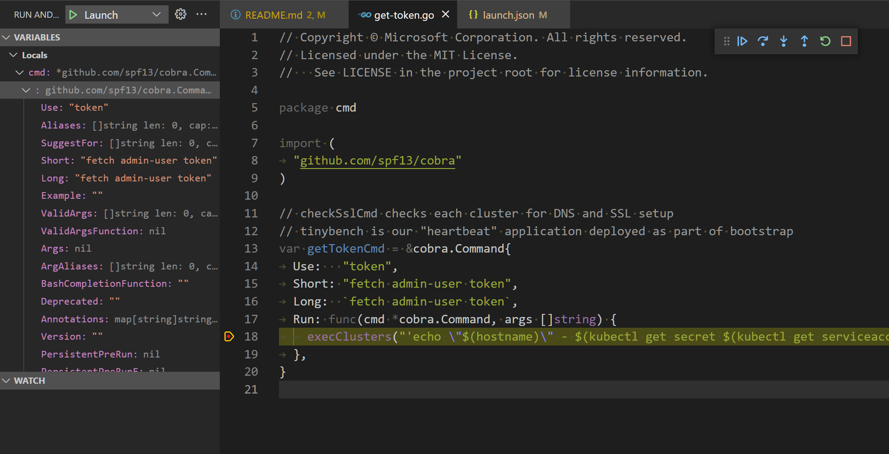

# Create Kubernetes Clusters in Azure VMs

- Create one or more k3d clusters in unique Azure VMs
  - Bootstrap the cluster
    - Traefik for ingress
    - Flux for GitOps
    - DNS (optional)
    - SSL (optional)
    - Dapr
    - Radius

## Setup

> From GitHub Codespaces

## Login to Azure

```bash

az login --use-device-code

```

## cd to the test-fleet directory

```bash

cd fleet/test-fleet

```

## Create the k3d cluster

- The VM will use `$HOME/.ssh/id_rsa` for SSH on port 2222
  - An SSH key will be generated if one doesn't exist
  - To reuse an existing SSH key, copy `id_rsa` and `id_rsa.pub` to `$HOME/.ssh`

> Our Codespaces installation automatically installs a "shared" ssh key

```bash

# run akdc create
akdc create -c central-tx-dallas-105 -l centralus

```

## Check Setup

- Run until `complete` is the status for each server
  - akdc is our CLI
    - Add $REPO_ROOT/bin to your path
      - Our Codespaces install does this automatically

        ```bash

        # check all servers in ips file
        akdc check setup

        ```

## Check Flux Setup

```bash

# check all servers in ips file
akdc check flux

```

## Setup DNS and SSL

- A DNS domain and SSL cert can be used with the cluster setup to provide an ingress for http and https access to the clusters
- In order to use a DNS, you must specify --ssl with a domain name
  - `akdc` assumes the --ssl param is both a domain and also an Azure DNS domain name

## Add ssl certs

> These files are unencrypted versions of your ssl cert
>
> Protect them appropriately!

- If you're using Codespaces, these files are in `~/.ssh/certs.pem` and `~/.ssh/certs.key`
  - You can skip this step
- [SSL Cert Setup](./CERTS.md)

## Create the Cluster with DNS and SSL

  ```bash

  # change to your DNS domain name
  export AKDC_ZONE=cseretail.com

  akdc create west-ca-east-105 -l westus --ssl "$AKDC_ZONE"

  ```

## Check SSL

- You have to deploy an app with ssl ingress first
  - We deploy [TinyBench](https://github.com/bartr/tinybench) as part of our cluster bootstrap

    ```bash

    akdc check ssl

    https://west-ca-east-105.${AKDC_ZONE}

    ```

## Delete the cluster

> Make sure to use `akdc delete west-ca-east-105` to delete the RG and DNS record

  ```bash

  akdc delete west-ca-east-105

  # Edit or delete your ips file to remove the IP address

  ```

## Azure ARC

This project creates k3d clusters that are [Azure ARC enabled.](https://docs.microsoft.com/en-us/azure/azure-arc/kubernetes/overview)

A service account named admin-user is provisioned during the create cluster process. This functionality provides a token that can be used to view Kubernetes workloads in the azure portal.

To fetch the admin user token:

- Create a cluster using akdc
- Wait until the cluster setup is complete and `akdc check setup` shows `complete.`
- Invoke `akdc get token` and not the token associated with the server that was just created.

```shell

$ akdc get token

west-ca-east-104 - <token>
```

To view Kubernetes workloads in the portal:

- Naviate to [the Azure Portal](https://portal.azure.com/.)
- Go to the Kubernetes services Resource Type
- Select the ARC enabled kubernetes cluster (eg. west-ca-east-104)
- Under "Kubernetes resources (preview)", select Namespaces.
- Paste the token collected from above `akdc get token` for the corresponding server.
- Note: Each cluster/server will have a unique token and the session remains valid as long as the portal tab/window is open. If the tab is closed, the token will have to be fetched and provided to the portal again.

- Once the token is validated, namespaces and other kubernetes resources will be available in the portal for that specific cluster.

 

## Debugging akdc

The akdc tooling is built as go command line tool using the [cobra library](https://github.com/spf13/cobra). Included in this repo is a launch.json file as well as the go extension for vscode , which is included in the dev container/code space configuration.

In order to debug, open this repo in a code space or vs code dev container. If prompted install the go cli tools by clicking the green "Install" button in vs code.

[launch.json](../.vscode/launch.json) contains an args section. This is for passing in command line arguments normally used in the shell.

Each argument should be on a separate line. For example the configuration corresponding to `akdc get token` would be:

```json
      "args": [
        "get",
        "token"
      ]
```

At this point you can set a breakpoint at the desired location of the akdc go code and invoke the debugger using the F5 key.

 

## Digital Ocean VMs

- Create a k3d cluster in one or more DO VM(s)
  - Bootstrap the cluster with Flux for GitOps

> Setup

- This is currently a manual setup from the DO portal
- `flt cluster create --do ...` will generate the setup script to paste into the `User Data` of the portal
